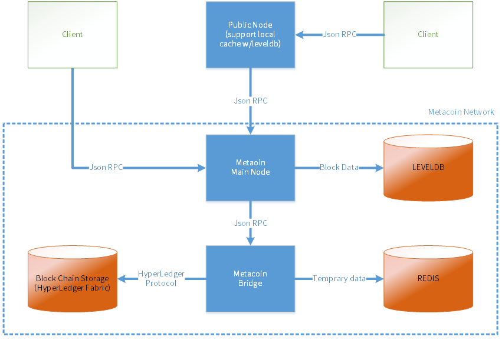

# Metacoin API

### What is METACOIN ?

* Metacoin is the World's first HyperLedger based Cryptocurrency with Application Protocol framework.

### Concept

#### Metacoin Struct

<figure><figcaption></figcaption></figure>

* **Client** is Metacoin user.
* **Public Node** is Metacoin node(is not require).
* **Main Node** is Metacoin main daemon.
* **Metacoin Bridge** is JSON-PRC convert to HyperLedger Fabric.

#### Address

* Can store Metacoin or Metacoin tokens.
* Used to prove that you are the owner of the token or the resource being stored.
* The only way to prove ownership of an address is by using a private key pairing with the public key you sent when you created the address.

#### MRC-010

* Metacoin standard for token create.
* The unique value that distinguishes the value generated by MRC-010 is the TOKEN ID.

#### Block

* One or more transactions are included.
* The creation of an address is also included in the Transaction.
* If no transaction occurs, no block is created.

#### Security

* If you need to prove that you are the owner of a resource, such as an address, to prevent reuse of packets forwarded using Json RPC, sign the packet by adding a temporary key issued by the Metacoin Network.
* Once used temporary key is discarded and can not be used again.

#### Node

* There is no separate node,and it is configured centrally rather than the traditional way of sending blocks in P2P mode.

### For more information, please see "REST API Reference"


[rest-api-reference](reference/rest-api-reference/)

